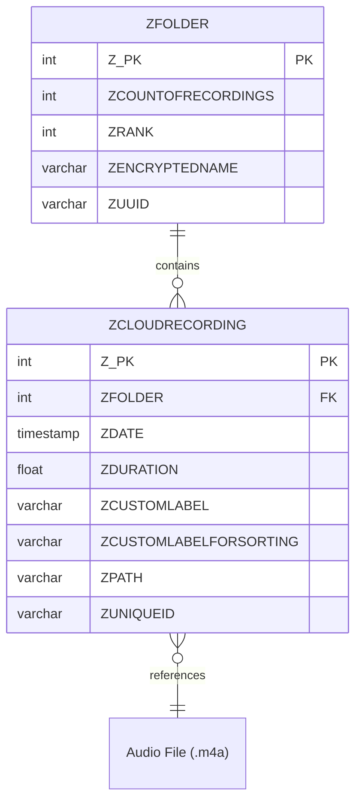

# Voice Memos Database Schema

This document describes the SQLite database schema used by the macOS Voice Memos
app. The schema is based on macOS Sonoma (14+).

## Entity Relationship Diagram



> **Note**: The database contains many additional tables for CloudKit sync
> (`ANSCK*` prefix), Core Data change tracking (`ACHANGE`, `ATRANSACTION`), and
> metadata. These are internal to Apple's implementation and not used by this
> exporter.

## Database Location

- **macOS Sonoma 14+**: `~/Library/Group Containers/group.com.apple.VoiceMemos.shared/Recordings/CloudRecordings.db`
- **macOS Ventura and earlier**: `~/Library/Application Support/com.apple.voicememos/Recordings/CloudRecordings.db`

## Main Tables

### ZCLOUDRECORDING

The primary table containing voice memo metadata. This is the table used by the
exporter script.

| Column                  | Type      | Description                                      |
|-------------------------|-----------|--------------------------------------------------|
| Z_PK                    | INTEGER   | Primary key                                      |
| Z_ENT                   | INTEGER   | Core Data entity ID                              |
| Z_OPT                   | INTEGER   | Core Data optimistic locking                     |
| ZFLAGS                  | INTEGER   | Internal flags                                   |
| ZSHAREDFLAGS            | INTEGER   | Sharing flags                                    |
| ZFOLDER                 | INTEGER   | Foreign key to ZFOLDER                           |
| ZDATE                   | TIMESTAMP | Recording date (Apple epoch: 2001-01-01)         |
| ZDURATION               | FLOAT     | Duration in seconds                              |
| ZEVICTIONDATE           | TIMESTAMP | When recording was evicted from device           |
| ZLOCALDURATION          | FLOAT     | Local duration (may differ if trimmed)           |
| ZCUSTOMLABEL            | VARCHAR   | User-defined label (pre-Sonoma)                  |
| ZCUSTOMLABELFORSORTING  | VARCHAR   | User-defined label (Sonoma+)                     |
| ZENCRYPTEDTITLE         | VARCHAR   | Encrypted title (iCloud)                         |
| ZPATH                   | VARCHAR   | Relative path to audio file                      |
| ZUNIQUEID               | VARCHAR   | UUID identifier                                  |
| ZAUDIODIGEST            | BLOB      | Audio file hash                                  |
| ZAUDIOFUTURE            | BLOB      | Future audio data                                |
| ZPLAYBACKRATE           | FLOAT     | Playback rate (default 1.0)                      |
| ZPLAYBACKPOSITION       | FLOAT     | Last playback position                           |
| ZPLAYBACKSPEED          | FLOAT     | Playback speed                                   |
| ZSILENCEREMOVERENABLED  | INTEGER   | Silence removal enabled flag                     |
| ZSKIPSILENCEENABLED     | INTEGER   | Skip silence enabled flag                        |
| ZSTUDIOMIXENABLED       | INTEGER   | Studio mix enabled flag                          |
| ZSTUDIOMIXLEVEL         | FLOAT     | Studio mix level                                 |

### ZFOLDER

Folders for organizing recordings.

| Column             | Type    | Description                |
|--------------------|---------|----------------------------|
| Z_PK               | INTEGER | Primary key                |
| Z_ENT              | INTEGER | Core Data entity ID        |
| Z_OPT              | INTEGER | Core Data optimistic lock  |
| ZCOUNTOFRECORDINGS | INTEGER | Number of recordings       |
| ZRANK              | INTEGER | Display order              |
| ZENCRYPTEDNAME     | VARCHAR | Encrypted folder name      |
| ZUUID              | VARCHAR | UUID identifier            |

### ZRECORDING (Legacy)

Used on older macOS versions. Same structure as ZCLOUDRECORDING but without
cloud sync fields.

## Apple Epoch

Apple uses a different epoch than Unix. Timestamps in the database are seconds
since **January 1, 2001** (Apple epoch), not January 1, 1970 (Unix epoch).

To convert to Unix timestamp:

```python
APPLE_EPOCH_OFFSET = 978307200.825232
unix_timestamp = apple_timestamp + APPLE_EPOCH_OFFSET
```

## Audio Files

Audio files are stored as `.m4a` files in the same directory as the database.
The `ZPATH` column contains the relative filename.

